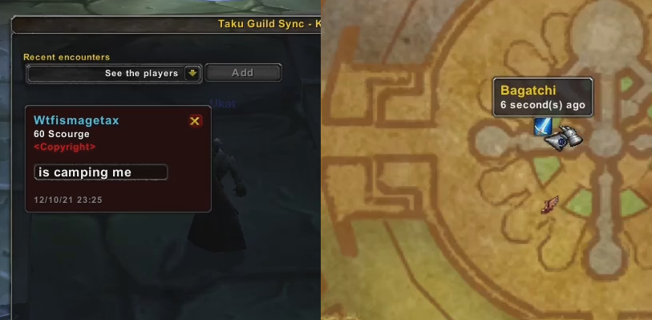

# TakuGuildSync

### Preview



### CurseForge link

https://www.curseforge.com/wow/addons/taku-guild-sync

### Features

- Synchronized Kill on sight (KOS) list within a guild.

- Reason of enlistment.

- Sound alerts on targeting and mouse over.

- World map markers.

- (Bonus) Guild ranks in chat.

### Limitations

- Players added to the list will disappear after **2 hours** if they're not seen in-game and if you haven't updated their reason of enlistment.

- The list has a limited capacity of **50 players at a time**. This includes players you manually remove from the list, as they have to reach the 2 hours timeout to be effectively removed anyway.

- World map markers indicate your own position and not your enemy's because WoW API doesn't provide this information, but this should be easy enough to find the target in a small radius.

### Tips

If your list is filled with suspicious entries, you may want to take a look at the event log to know which person sent them to you. Note that this person is not always guilty and could simply be passing informations from another person, but it will give you a starting point of investigation.

```
/tgs log
```

If you wish to enlist a player for a longer time, say he is a public enemy and not just a random camper and if you have the **consent** of your guild, you can add them to the list for up to 30 days with the command :

```
/tgs debug_persistkos PLAYERNAME : NUMBER_OF_DAYS_FROM_1_TO_30
```

>Reason of enlistment will be locked, so you might want to update it before doing that.
They can be removed but will just be hidden and **take a spot in the list** until their sentence is over.

## Technical Documentation ##

This project features my approach on synchronizing data in a decentralized network.

It’s designed for the World of Warcraft environment, where the main objective is to minimize network traffic.

### Algorithm Breakdown

When a new peer *P* joins the network, it will ask for another peer *P’* at random about the state of his data. We call this operation a “***discovery***”. If *P’* is also a peer looking for *discovery*, or not responding in a reasonable time, *P* will send a new *discovery* to another random peer. This process repeats until *P* runs out of other peers to ask, or find a suitable *P’*.

The *discovery* request contains only a state ID, that is a hash of the sender’s data. *P’* will send a reply to *P*, we call this operation "***welcome"***. It contains their state ID and if their states differ, their entire dataset. This is the only time a peer will send this much data to another, and this may take more than 12 seconds for a list of 50 entries (arbitraty defined limit of the implemented *KOS* list).

Upon receiving the *welcome*, *P* will merge content of *P’* into his own data by choosing the most recent version for each entry. Then if *P* has entries with a different version than *P'*, it will broadcast these to all peers. We call this operation a “***share***”. *P* is now synchronized and will be able to reply to incoming *discovery* requests.

If *P* didn't manage to find a *discovery* partner (because they went offline or lagging), they will *share* their data with all peers, as new peers could have joined in the meantime. This operation is even more heavy than what *welcome* does, but should be very rare and limited to a few peers if it was to occur.

A *share* is always processed even by peers that are still in *discovery* phase (not yet synchronized), because they may receive the data before their *discovery* partner *P'*, thus losing the data. The data received in a *share* is simply merged into theirs in the same way than for a *welcome*.

### Version comparison

The hash function takes a combination of all relevant dates for an entry :
- Date of internal update - when an enemy is seen, keep track of the latest update on his attributes (level, class, etc).
- Date of archive - when a player is manually removed from the list, or re-added, this is updated.
- Date of enlist reason - when the reason of enlistment is updated.

The version of a data entry comes out different only if one of these dates changes. It allows to add new data fields in the scope of these 3 dates without needing a major update of the protocol for everyone to keep using the add-on. If some peers use older releases of the add-on, they will have less informations but they can still communicate with peers on recent releases.

### Security

This model only works in an horizontal hierarchy. It means you have to trust all peers in the network not to alter the code to give themselves infinite power. This is why we have to put limitations and checks where there could be annoyance. The list is capped to avoid getting flooded and a check is made on every message reception to verify if the sender is still in your guild. We rely on logging what we receive and manual investigations to detect if a peer is suspicious. 

It's enough for a *KOS* list where there are no permissions, so cheating is meaningless. However, if we wish to add different level of rights for a feature, we would have to design preventive measures (read the [Going further section](#going-further) for that matter).

### Updates

In case of a major update in the protocol (e.g. adding a new date to the hash function), the new release will have to increment the version in the **GLOBAL_COMM_CHANNEL** constant. This is will of course break backward compatibility.

In case of a structural update (e.g. renaming or moving fields) in the persistent data (what is saved on disk under *SavedVariables*), the new release will have to increment the version in the **DB_VERSION_NAME** constant and in the TakuGuildSync.toc file. This will clear the database on next launch to avoid reading incompatible data.

### Dependencies

- [LibStub](https://www.curseforge.com/wow/addons/libstub)
- [CallbackHandler-1.0](https://www.curseforge.com/wow/addons/callbackhandler)
- [LibDataBroker-1.1](https://www.wowace.com/projects/libdatabroker-1-1)
- [Ace-3.0](https://www.wowace.com/)
- [LibDBIcon](https://www.wowace.com/projects/libdbicon-1-0)
- [HereBeDragons-2.0](https://www.curseforge.com/wow/addons/herebedragons)

### Going further

You are welcome to use this project as a base for your own add-on or to contribute to the project with new features and improvements.

The most important system to design now is allowing different levels of permission. This is required to make actions restricted to specific roles. One way to achieve this would be to assign roles based on **guild ranks** because they can be verified in the game API and cannot be self-granted in the add-on. A second part would be to improve detection of impostors as it's currently a tedious work.

*Let's think with an example.*

We imagine a feature where officers can create guild events and members can sign up. We want all our peers to carry and spread the information of an upcoming event. This way, even if the officer is offline, other peers will receive the invitation. Any peer can verify if the person sending the invite is an officer or not. However a peer could be pretending to relay an invite from an officer that he instead created himself. This fake invite could only be dismantled when the officer comes online and **manually** accepts or denies this event, as if he changed computer and had to verify all events he supposedly initiated.

Now, we want to give our participants points for their attendance to the event. Event points would be a guild wise currency similar to a guild reputation within the add-on. This data would be shared by all peers like any other. A malicious peer could increase his guild reputation easily. To verify that his gains are legitimate, officiers would have to store an history of **all** events (their participants and number of points awarded) and not just a plain total of points. Not only this is a lot of information to store and synchronize between officiers, but this would also require setting up external backups to be safe against losing informations in case of disk failure or database drops ([see Updates section](#updates)).

For the second part, we could improve detection of impostors by allowing an hard-coded administrator (or using the guild rank permissions), to fetch the event logs (what data they received from who) of all compliant peers and match them to find data inconsistency. This operation could be done automatically in the long term.
